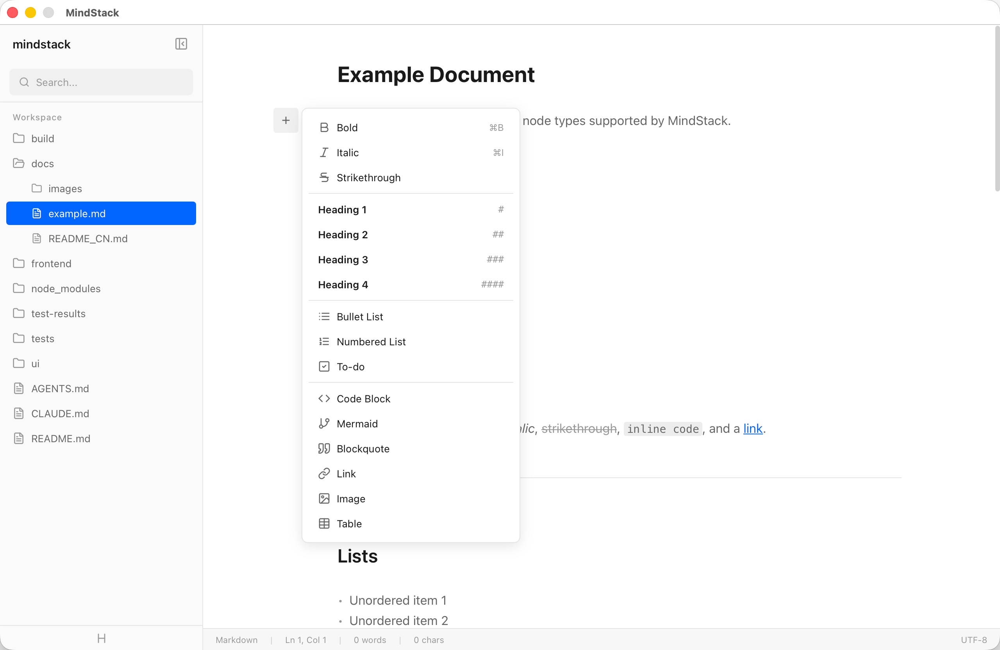

# MindStack

[中文](docs/README_zh.md)

A developer-focused markdown editor with git repository sync, designed for developers and AI codegen tools to maintain knowledge bases.

## Features

- Markdown editing and rendering
- Git repository sync
- AI-friendly CLI



See [example.md](docs/example.md) for all supported node types.

## Getting Started

Go to [Releases](https://github.com/qiushijie/mindstack/releases) and download the latest installer for your platform.

## Development

### Prerequisites

- [Go](https://go.dev/dl/)
- [Node.js](https://nodejs.org/) with pnpm
- [Wails CLI](https://wails.io/docs/gettingstarted/installation)

```bash
go install github.com/wailsapp/wails/v2/cmd/wails@latest
cd frontend && pnpm install
```

### Dev

```bash
wails dev
```

### Build

```bash
wails build
```

Build output goes to `build/bin/`.

### Test

```bash
# Go tests
go test ./...

# Frontend unit tests (vitest + happy-dom)
cd frontend && pnpm vitest run

# Editor regression threshold (unit + core editor e2e)
./scripts/editor-regression.sh

# Full E2E tests (Playwright)
# Make sure `wails dev` is running first, then:
cd tests/e2e && pnpm test
```

The editor regression script runs the frontend unit tests plus the three core
editor e2e specs. Run the full e2e suite for large editor changes or before a
release.

Playwright E2E tests run concurrently across spec files during local runs to keep
the full suite practical. Tests must be written with isolated state and must not
depend on spec execution order. If a failure looks timing- or state-related,
rerun serially with:

```bash
cd tests/e2e && pnpm exec playwright test --workers=1
```

## License

MIT
