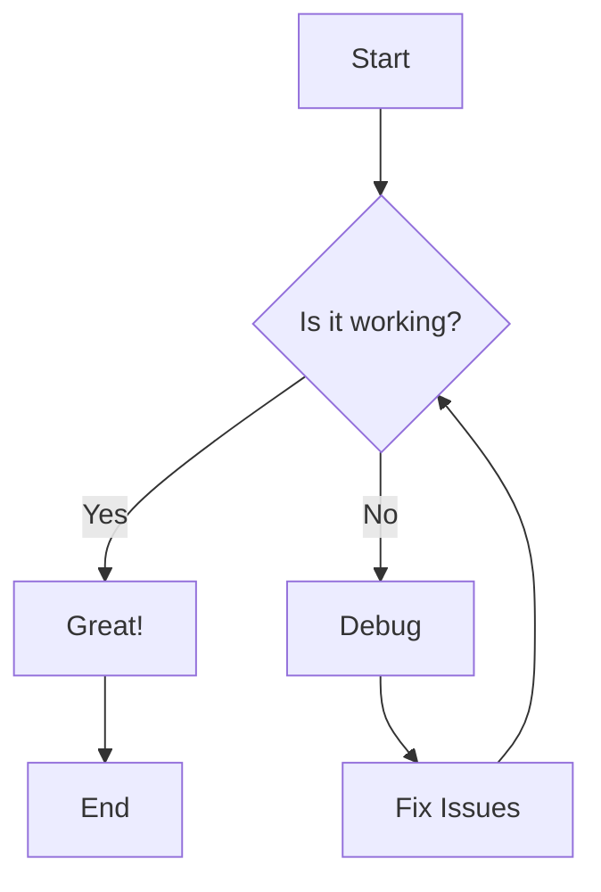

# Example Document

This document demonstrates all node types supported by MindStack.

# Heading 1

## Heading 2

### Heading 3

#### Heading 4

##### Heading 5

###### Heading 6

This is a paragraph with **bold**, *italic*, ~~strikethrough~~, `inline code`, and a [link](https://example.com).

---

## Lists

- Unordered item 1
- Unordered item 2
  - Nested item

1. Ordered item 1
2. Ordered item 2

- [ ] Todo item (unchecked)
- [x] Todo item (checked)

## Blockquote

> This is a blockquote.
> It can span multiple lines.

## Code Block

```go
package main

import "fmt"

func main() {
    fmt.Println("Hello, MindStack!")
}
```

## Table

| Name  | Type   | Description    |
|-------|--------|----------------|
| id    | int    | Primary key    |
| title | string | Document title |

## Math

Inline formula: $E = mc^2$

Block formula:

$$
\int_{-\infty}^{+\infty} e^{-x^2} dx = \sqrt{\pi}
$$

Matrix example:

$$
A = \begin{pmatrix}
a_{11} & a_{12} & a_{13} \\
a_{21} & a_{22} & a_{23} \\
a_{31} & a_{32} & a_{33}
\end{pmatrix}
$$

## Mermaid Flowchart


